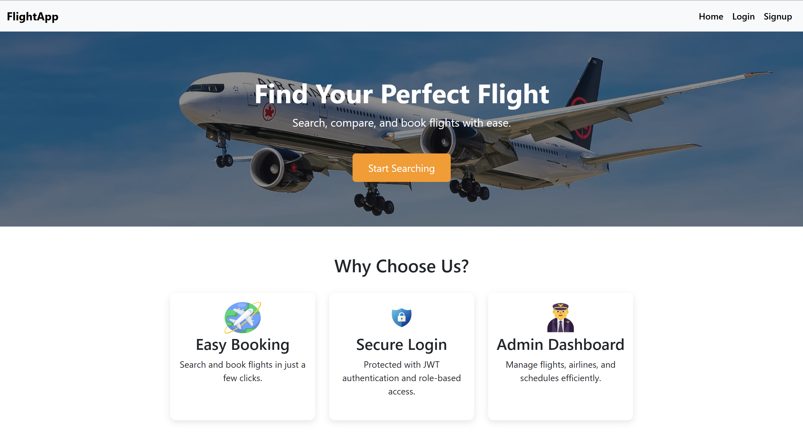
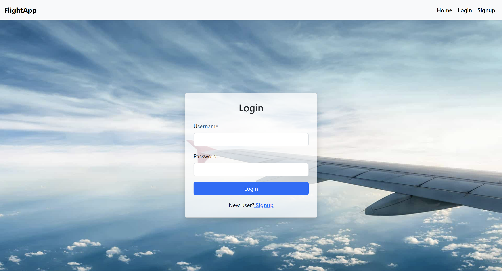
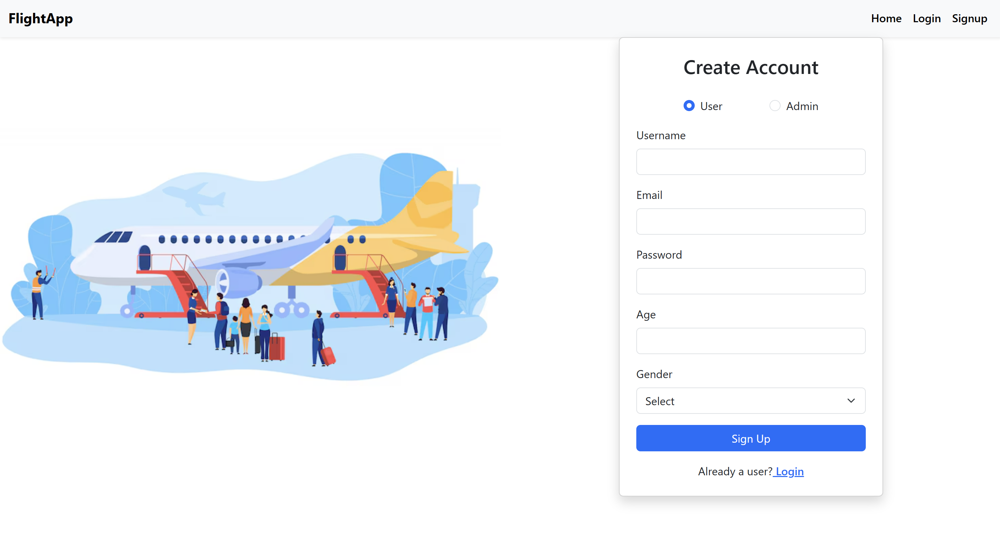
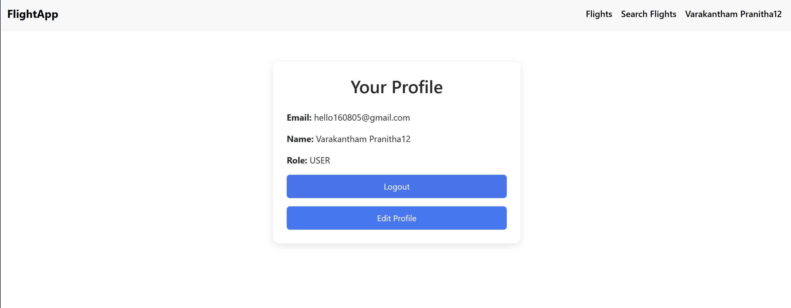
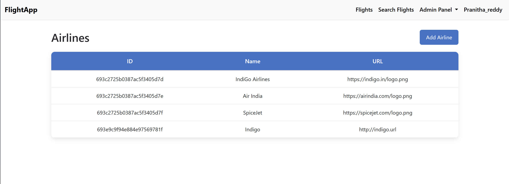
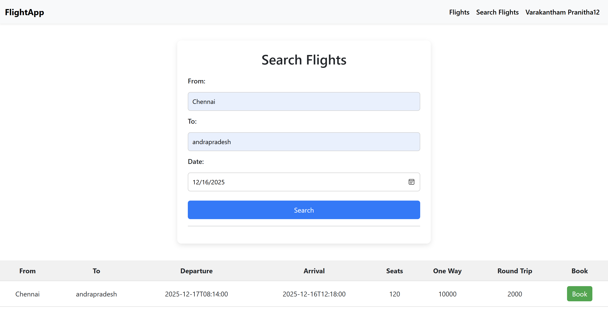
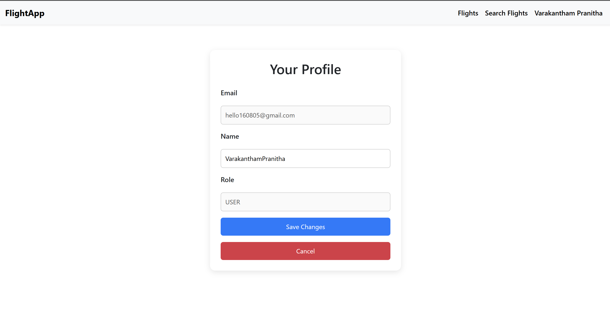
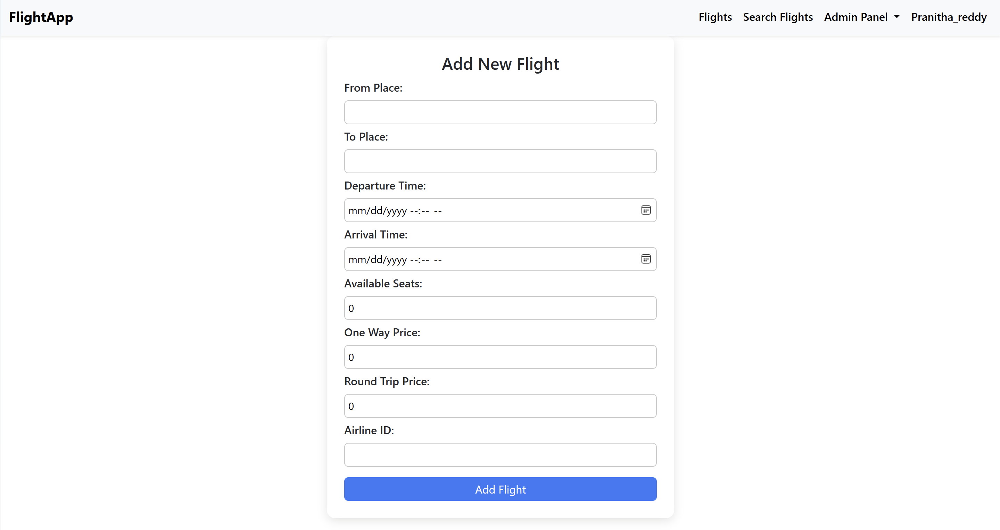

# Flight Booking System – Angular Frontend

A complete, production‑ready flight booking application built using Angular.  
This frontend communicates with a Spring Boot backend and supports secure authentication, role‑based access, flight management, seat selection, and a full user booking flow.

---

## Overview

This project is a full‑stack airline reservation system designed for both **end‑users** and **administrators**.  
It includes:

- A modern Angular UI  
- Secure JWT‑based authentication  
- Role‑aware navigation    
- Admin flight management  
- Airline management  
- User profile management  
- Reusable components and clean architecture  

---

## Authentication & Authorization
### Login Page

### Signup Page

### JWT Authentication  
- Login generates a JWT token from backend  
- Token stored in `localStorage`  
- Token attached to every API request using an **HTTP interceptor**

### Route Guards  
- **AuthGuard** → blocks routes unless user is logged in  
- **AdminGuard** → blocks admin pages unless role = ADMIN  
- Guards validate token + role before navigation

### Auto‑Logout  
- Token expiry detection  
- Automatic redirect to login  
- Navbar updates instantly after login/logout

---

## Navigation System
### User Navbar

### Admin Navbar

### Role‑based Navbar  
- User sees: Home, Search Flights, Profile, Logout  
- Admin sees: Add Flight, Flight List, Airlines, Logout  
- Navbar updates dynamically based on login state

### Standalone Components  
All components use Angular’s modern standalone architecture for cleaner imports and faster builds.

---

## User Features

### Flight Search
- Search by source, destination, date  
- Validates inputs  
- Calls backend `/flights/search`  
- Displays results in responsive cards  

### User Profile
- Fetches details  
- Update name, email  
- Future: booking history

---

## Admin Features

### Add Flight

- Form includes airline, source, destination, date, time, price, seats  
- Validates all fields  
- Sends POST request to backend

### Edit Flight
- Pre‑filled form  
- Update any field  
- Sends PUT request to backend

### Delete Flight
- Confirmation before delete  
- UI updates instantly  
- No page refresh required

### Airline Management
- Add airline  
- View airline list  
- Used in flight creation dropdown

